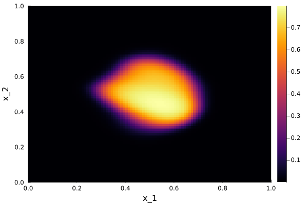

# Adaptive Treatment for Heterogeneity in Melanoma

This repository contains code for simulating and visualizing the adaptive treatment response in melanoma tumor heterogeneity using a 4D partial differential equation (PDE) model.

## Description

The code simulates the dynamics of a tumor microenvironment using a 4D PDE model, taking into account melanoma cells, ECM-NE (Extracellular Matrix and Nutrient Environment), chemical molecules, and drug molecules. The simulation implements an adaptive treatment approach, where a BRAF/MEK inhibitor treatment is dynamically applied based on tumor volume thresholds.

## Implementation Details

The code is written in Julia programming language. It utilizes various functions and operators to simulate the PDE model and visualize the results. The main steps include:

1. Initialization of parameters, arrays, and functions.
2. Iteration over time steps, with an adaptive treatment regimen.
3. Computation of predictor and corrector steps to update variable distributions.
4. Constraint enforcement to ensure variables remain within valid ranges.
5. Periodic visualization of results and tumor volume tracking.

## Model
The Melanoma heterogeneity model used in this study involves a partial differential equation (PDE) framework to describe the dynamics of the cancer cell population. The general form of the PDE is given by: 
```
∂c/∂t = ∇ₓ · Fₓ - ∇ᵧ · Fᵧ + S(x, y, t)
```

The terms in the PDE represent different aspects of the cancer cell population dynamics:

- The spatial flux term Fₓ captures the movement of cells in space, including diffusion and directed movement (chemotaxis and haptotaxis). [See paper for detailed expression.](https://www.frontiersin.org/journals/oncology/articles/10.3389/fonc.2022.857572/full)
- The structural flux term Fᵧ represents the continuous changes in the cell state, accounting for gene expression variations. It includes diffusive and advective components. [See paper for detailed expression.](https://www.frontiersin.org/journals/oncology/articles/10.3389/fonc.2022.857572/full)
- The source term S(x, y, t) incorporates cell proliferation, degradation, and other discrete stochastic changes in the cell state. [See paper for detailed expression.](https://www.frontiersin.org/journals/oncology/articles/10.3389/fonc.2022.857572/full)


This model utilizes Neumann Boundary Conditions (∇u · n = 0) to handle boundary scenarios effectively within the discretized 4D domain.


## Dependencies

- Julia: [Download Julia](https://julialang.org/downloads/)
- Julia packages (install using `using Pkg; Pkg.add("package_name")`):
  - Dates
  - Plots
  - Images

## Usage

1. Install Julia and required packages.
2. Clone this repository: `git clone https://github.com/yourusername/repo.git`
3. Navigate to the repository folder: `cd repo`
4. Run the simulation: `julia run_adapt.jl`

## Results

The code generates visualizations of tumor heterogeneity evolution over time. It creates images showing the tumor distribution and tumor volume changes.

### Tumor volume (mm^3) in function of time
(Green->Tumor under treatment, Red->Treatment stoped)


### Tumor distribution in the spatial dimensions at different time points

 t=0 days

 t=40 days

 t=100 days

 t=200 days

 t=300 days

 t=360 days


## Model Reference

The adaptive treatment model implemented in this code is based on the research presented in the following paper:

**Title:** [Adaptive Treatment for Heterogeneity in Melanoma Using a 4D Partial Differential Equation Model](https://www.frontiersin.org/journals/oncology/articles/10.3389/fonc.2022.857572/full)

**Authors:** Arran Hodgkinson, Dumitru Trucu, Matthieu Lacroix, Laurent Le Cam, Ovidiu Radulescu

**Journal:** Frontiers in Oncology

**Year:** 2022

This paper provides detailed information about the mathematical model, simulation approach, and findings related to the adaptive treatment strategy for melanoma heterogeneity. We encourage interested readers to explore the paper for a deeper understanding of the underlying principles and implications of the model.

## Citation

If you use this code or the ideas presented in the paper for your own research, please consider citing the original paper: [PAPER](https://www.frontiersin.org/journals/oncology/articles/10.3389/fonc.2022.857572/full) 


## License

This project is licensed under the MIT License - see the [LICENSE](LICENSE) file for details.
